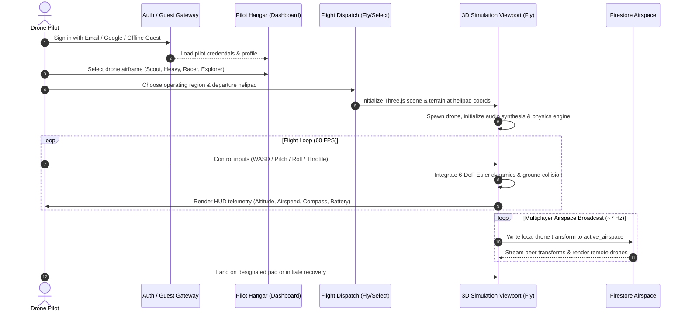
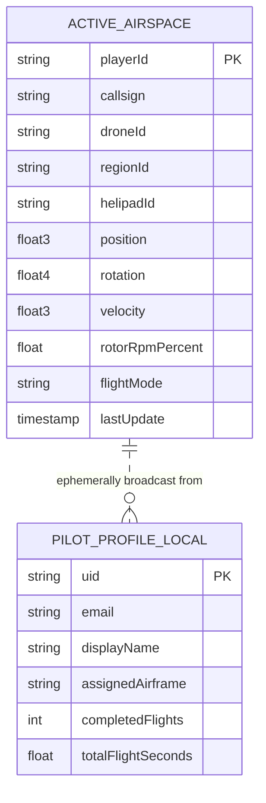
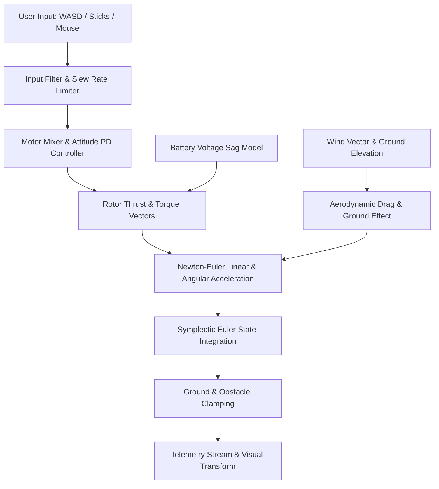
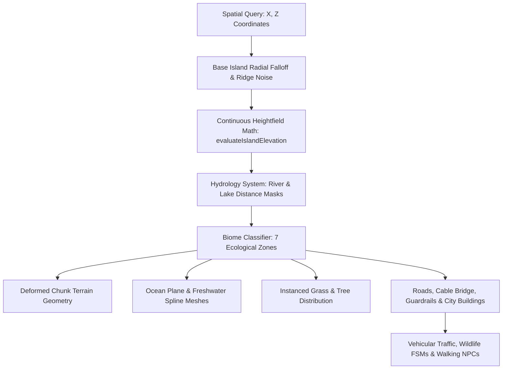
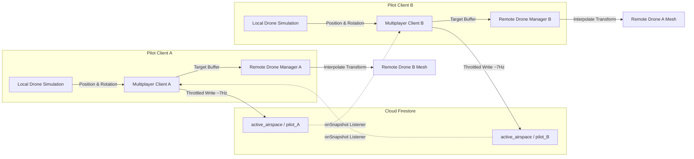

# DRONE PILOT
## Project Status & Technical Architecture Report

**Document Version:** 1.0.0  
**Audit Date:** September 17, 2026  
**Auditor:** Automated Engineering Intelligence & Codebase Inspection Suite  
**Repository:** `dhruvdaberao/Drone-Pilot`  
**Branch:** `main`  
**Target Platform:** Modern Web Browsers (WebGL 2.0 / Web Audio API / ES2023)

---

## 1. Executive Summary

**DRONE PILOT** is an interactive web-based 3D drone flight simulation, tactical pilot training, and digital airspace platform built with **Next.js 15.1.7 (App Router)**, **React 19.0.0**, **Three.js 0.185.1**, and **Firebase 11.3.1**.

The platform is designed to bridge foundational flight mechanics education, realistic quadcopter control training, and open-world exploration. As of this milestone, the project has established:
1. A **6-DoF numerical rigid-body flight dynamics simulator** with closed-loop PD hover-lock stabilization, ground collision, battery discharge models, and multi-profile drone parameters.
2. A **4.8 km × 4.8 km continuous procedural island world** with 7 distinctive ecological and urban regions, mathematical coastline synthesis, hydrology masking, custom GLSL water and instanced grass shaders, autonomous vehicular road traffic, FSM wildlife, and walking reactive NPCs.
3. An **in-flight telemetry HUD** featuring responsive altitude, airspeed, climb rate, compass headings, spatial mini-maps, directional joystick indicators, battery health monitoring, and audio synthesizers for brushless motor harmonics, aerodynamic wind, and environmental proximity soundscapes.
4. An **ephemeral Firebase Firestore multi-client airspace relay** enabling real-time remote drone positioning, orientation synchronization, and callsign labeling.
5. User authentication through Firebase Auth (Email/Password & Google OAuth) with seamless offline mock storage fallback.

The core world geography, physics foundation, and cockpit interfaces are fully functional and verifiable in production builds. Advanced features such as server-side authoritative physics, cloud flight blackbox persistence, and complex mission objectives are planned for future phases.

---

## 2. Project Vision

The long-term vision of DRONE PILOT is to become an accessible, browser-native pilot training platform that teaches real-world unmanned aerial vehicle (UAV) aerodynamics, airspace navigation regulations, and tactical emergency recovery protocols without requiring proprietary hardware or heavy local simulator installations.

Key pillars include:
- **Zero-Barrier Simulation:** Instant access via modern desktop and mobile browsers with low latency and progressive performance tiering.
- **Scientific Foundation:** Physics modeling that respects real aerodynamic principles (rotor disc thrust, torque reaction, aerodynamic drag, battery voltage sag under burst load, ground effect, and atmospheric turbulence).
- **Living Digital Environment:** A coherent, visually engaging stylized 3D world featuring maritime ports, metropolitan skyscapes, mountain switchbacks, rural pastures, and pristine rivers rather than sterile synthetic test grids.
- **Progressive Flight Curriculum:** Guided flight training tracks advancing from basic hover control to complex line-of-sight (LOS) and first-person view (FPV) acro maneuvers.

---

## 3. Current Product Status

The codebase is categorized as a **Functional Alpha / Interactive Technical Prototype**.

- **World & Environment:** Complete for Phase 1 (Geography), Phase 2 (Natural Systems), and Phase 3 (Living World Polish). The terrain, hydrology, road network with steel W-beam guardrails, dynamic multi-biome instanced grass, procedural traffic, wildlife FSMs, and regional landmarks are active.
- **Flight Physics & Control:** Fully implemented client-side 6-DoF flight dynamics engine with keyboard (WASD/Arrows), mouse-look, and touch controls. Anti-jitter input filtering and auto-hover assist are operational.
- **Multiplayer Airspace:** Partially implemented. Ephemeral broadcast of drone transforms to Firestore `active_airspace` collection works for peer presence. Authoritative reconciliation and physics synchronization are not yet present.
- **Missions & Progression:** Placeholder / Initial framework. Flight preparation and helipad selection routes exist; structured scoring, automated airspace checks, and achievement unlocks remain in prototype phase.
- **Data Persistence:** In-memory and local browser storage are primary. Only real-time airspace telemetry writes to Firestore; pilot career logs and blackbox recordings are client-side only.

---

## 4. Technology Stack

| Layer | Technology | Version | Purpose |
|---|---|---|---|
| **Core Framework** | Next.js (App Router) | 15.1.7 | Server-side routing, static page generation, asset optimization |
| **UI Library** | React | 19.0.0 | Component rendering and reactive application state |
| **Language** | TypeScript | 5.7.3 | Static type safety and data modeling |
| **Styling** | Tailwind CSS | 3.4.17 | Utility-first responsive design and HUD styling |
| **Class Utilities** | clsx & tailwind-merge | 2.1.1 / 2.6.0 | Dynamic CSS class composition |
| **Iconography** | Lucide React | 0.475.0 | Tactical HUD and navigation UI iconography |
| **3D Rendering** | Three.js | 0.185.1 | WebGL scene management, meshes, custom GLSL shaders, camera |
| **3D Types** | @types/three | 0.185.4 | Ambient Three.js TypeScript definitions |
| **Backend & Auth** | Firebase JS SDK | 11.3.1 | Authentication (Email/Google) and Cloud Firestore client |
| **Audio** | Web Audio API | Native Browser | Custom procedural tone generators, noise buffers, and spatial panning |
| **E2E Testing** | Playwright | 1.63.0 | Headless end-to-end flight test scaffolding |

---

## 5. System Architecture

DRONE PILOT uses a decoupled modular architecture separating the Next.js UI layer from the Three.js WebGL simulation loop and the Firebase network bridge.

```mermaid
graph TD
    subgraph BrowserClient [Browser Client Runtime]
        subgraph NextUI [Next.js React UI Layer]
            Dashboard[Dashboard & Drone Selection]
            FlightPrep[Flight Prep & Helipad Selector]
            TelemetryHUD[Telemetry HUD & Radar]
            ControlsOverlay[Touch & Key Controls Overlay]
            AuthPages[Authentication Pages]
        end

        subgraph SimEngine [Three.js Simulation Core]
            InputMgr[Input Manager]
            FlightPhysics[6-DoF Flight Physics Engine]
            ModularDrone[Modular Drone 3D Mesh & Rotors]
            ChaseCamera[Chase / Cockpit / Free Camera]
            WorldManager[World & Regional Environment Manager]
            AudioMgr[Web Audio Synthesis Engine]
        end

        subgraph WorldSystems [World Subsystems]
            TerrainSys[Terrain & Heightfield Math]
            WaterSys[Hydrology & Ocean Shader]
            GrassSys[Instanced Multi-Biome Grass]
            RoadSys[Road Network & Guardrails]
            TrafficSys[Autonomous Traffic Manager]
            WildlifeSys[FSM Wildlife & NPC System]
        end
    end

    subgraph FirebaseCloud [Firebase Cloud Services]
        FirebaseAuth[Firebase Authentication]
        FirestoreAirspace[Cloud Firestore: active_airspace]
    end

    InputMgr -->|Normalized Commands| FlightPhysics
    FlightPhysics -->|State & Transform| ModularDrone
    FlightPhysics -->|Telemetry Packet| TelemetryHUD
    FlightPhysics -->|Velocity & RPM| AudioMgr
    ModularDrone -->|World Position| ChaseCamera
    WorldManager --> WorldSystems
    FlightPhysics -->|Collision & Clamping| TerrainSys
    FlightPhysics -->|Ephemeral Broadcast ~7Hz| FirestoreAirspace
    FirestoreAirspace -->|Remote Peer Snapshots| SimEngine
    AuthPages -->|Credentials| FirebaseAuth
```



---

## 6. Repository Architecture

The repository adheres to Next.js App Router conventions with strong modularity in `src/`:

```
Drone-Pilot/
├── package.json                   # Dependencies, build scripts, versions
├── tsconfig.json                  # TypeScript compiler settings (@/* paths)
├── next.config.ts                 # Next.js configuration
├── tailwind.config.ts             # Tailwind design tokens and tactical colors
├── public/                        # Static textures, markers, environmental assets
└── src/
    ├── app/                       # Next.js App Router routes
    │   ├── page.tsx               # Root landing portal
    │   ├── layout.tsx             # Root layout with auth wrapper
    │   ├── dashboard/page.tsx     # Pilot hangar and stats overview
    │   ├── fly/
    │   │   ├── page.tsx           # Active flight simulator view
    │   │   └── select/page.tsx    # Regional deployment & helipad selection
    │   ├── (auth)/                # Auth group (login, signup, forgot-password)
    │   ├── privacy/page.tsx       # Legal privacy disclosure
    │   └── terms/page.tsx         # Platform terms of service
    ├── components/                # React UI and Three.js viewports
    │   ├── auth/                  # Login, signup, and verification cards
    │   ├── dashboard/             # 3D hangar drone inspector and stats
    │   ├── flight-prep/           # Tactical map, region cards, helipad picker
    │   ├── simulator/             # Simulator runtime components
    │   │   ├── flight-simulator.tsx    # Canvas mount and animation loop driver
    │   │   ├── modular-drone.ts        # Procedural 3D drone mesh builder
    │   │   ├── chase-camera.ts         # Spring-damped chase camera controller
    │   │   ├── telemetry-hud.tsx       # Cockpit glass instrumentation
    │   │   ├── minimap-widget.tsx      # Real-time top-down tactical radar
    │   │   ├── island-map-modal.tsx    # Fullscreen vector tactical island map
    │   │   ├── base-switcher-hud.tsx   # Fast base deployment selector
    │   │   ├── multiplayer/            # Remote drone interpolation & roster
    │   │   └── world/                  # Environment, terrain, city, water systems
    │   └── ui/                    # Tactical buttons, inputs, alerts, badges
    └── lib/                       # Pure logic, math, engines, and services
        ├── audio/                 # Web Audio oscillators, motor tones, wind SFX
        ├── firebase/              # Firebase client initialization and auth hooks
        ├── multiplayer/           # Firestore broadcast and peer sync client
        ├── simulation/            # Numerical physics, battery, mixer, recorder
        └── world/                 # Continuous terrain math, biomes, hydrology
```

---

## 7. User Workflow

The end-to-end user journey transitions from account onboarding through tactical deployment and in-flight operations:



---

## 8. Authentication

- **Provider:** Firebase Authentication (v11.3.1).
- **Supported Methods:** Email and Password authentication, Google OAuth popup sign-in.
- **Offline / Development Fallback:** When Firebase environment variables are unpopulated or network access is restricted, an automated mock authentication provider maintains session state via `localStorage` under `drone_pilot_mock_user`.
- **Protected Routes:** Next.js client-side route guards redirect unauthenticated sessions to `/login` when attempting to enter `/dashboard` or `/fly`.
- **Status:** **IMPLEMENTED** (Production-ready auth flow with robust fallback).

---

## 9. Database Architecture

- **Database Engine:** Google Cloud Firestore (Client SDK).
- **Active Collections:**
  - `active_airspace/{playerId}`: Ephemeral document holding real-time pilot telemetry.
- **Schema:**
  ```typescript
  interface ActiveAirspaceDoc {
    playerId: string;
    callsign: string;
    droneId: string;
    regionId: string;
    helipadId: string;
    position: { x: number; y: number; z: number };
    rotation: { x: number; y: number; z: number; w: number };
    velocity: { x: number; y: number; z: number };
    rotorRpmPercent: number;
    flightMode: 'STABILIZE' | 'ALT_HOLD' | 'ACRO';
    lastUpdate: Timestamp;
  }
  ```
- **Database Architecture Diagram:**



- **Limitations:** Persistent flight logging, historical blackbox tracks, mission progression, and user achievements are currently maintained in memory or client-side storage rather than committed to persistent Firestore collections.
- **Status:** **PARTIAL** (Real-time ephemeral presence implemented; long-term data persistence planned).

---

## 10. Drone Architecture

The drone visual presentation is built by `ModularDrone` (`src/components/simulator/modular-drone.ts`), a hierarchical procedural Three.js model generator:
- **Central Fuselage:** Aerodynamic carbon-composite body pod, front FPV camera gimbal, rear cooling vent, and central battery bay.
- **Structural Booms:** 4 tubular carbon-fiber arms extending to motor nacelles.
- **Propulsion Assembly:** 4 brushless outrunner motor housings with counter-rotating dual-blade or tri-blade propellers.
- **Visual FX:** Independent rotor spin animation driven by individual motor RPM, anti-collision strobe LEDs (red/green nav lights, pulsing white tail beacon), and ground-projected downwash dust ring shaders.
- **Status:** **IMPLEMENTED**.

---

## 11. Flight Physics

Flight dynamics are calculated in `FlightPhysicsEngine` (`src/lib/simulation/flight-physics.ts`):
- **Simulation Step:** Fixed-timestep integration (default `dt = 1/60s`) independent of display frame rate jitter.
- **State Vector:**
  $$\mathbf{X} = [x, y, z, v_x, v_y, v_z, \phi, \theta, \psi, p, q, r]^T$$
  representing 3D world position, linear velocity, Euler orientation (Roll, Pitch, Yaw), and angular rates.
- **Hover Assist & Vertical PD Loop:** Automatically calculates required counter-gravity thrust:
  $$T_{\text{hover}} = \frac{m \cdot g}{\cos(\phi) \cos(\theta)}$$
  plus proportional-derivative altitude damping when vertical inputs are neutral.
- **Aerodynamic Drag:** Quadratic air resistance model:
  $$\mathbf{F}_{\text{drag}} = -\frac{1}{2} \rho C_d A |\mathbf{v}| \mathbf{v}$$
- **Battery Dynamics:** `BatteryModel` calculates nominal discharge curve, internal resistance, and voltage sag proportional to instantaneous total motor amperage draw.
- **Collision Envelope:** Ground clamping against continuous mathematical island elevation with bounce elasticity and surface friction damping.
- **Simulation Flow Diagram:**



- **Status:** **IMPLEMENTED** (Solid client-side 6-DoF numerical model).

---

## 12. Drone Controls

- **Keyboard Scheme:**
  - `W / S`: Pitch forward / backward
  - `A / D`: Roll bank left / right
  - `Arrow Up / Arrow Down`: Throttle ascend / descend
  - `Arrow Left / Arrow Right`: Yaw rotate counter-clockwise / clockwise
  - `Space`: Rapid emergency brake / hover stabilizer
  - `C`: Toggle camera views (Chase, Cockpit FPV, Orbit)
  - `M`: Open full island tactical map
  - `H`: Return to nearest helipad
- **Touch / Mobile Scheme:** Dual virtual thumbsticks rendered via `MobileTouchControls` with dynamic deadzones and haptic response hooks.
- **Anti-Jitter:** Exponential moving average (EMA) smoothing prevents abrupt digital key snap.
- **Status:** **IMPLEMENTED**.

---

## 13. Camera System

Controlled by `ChaseCameraController` (`src/components/simulator/chase-camera.ts`):
- **Third-Person Chase:** Spring-damper trailing camera positioned behind and above the airframe with velocity-aligned look-ahead and centrifugal swing banking.
- **Cockpit / FPV Mode:** Rigidly attached to front gimbal mount with pitch horizon indication and vibration shake under high dynamic pressure.
- **Free Orbit Mode:** Spherical mouse drag inspection camera for pre-flight walkaround.
- **Obstacle Occlusion:** Basic ground avoidance preventing camera clipping under terrain.
- **Status:** **IMPLEMENTED**.

---

## 14. Telemetry System

Rendered via `TelemetryHud` (`src/components/simulator/telemetry-hud.tsx`):
- **Primary Flight Display:**
  - Digital airspeed tape (m/s and knots)
  - Barometric altitude & AGL (Above Ground Level) radio-altimeter tape
  - Vertical speed indicator (climb / descent rate)
  - Heading compass tape with cardinal markers
  - Artificial horizon ladder with pitch/roll pitch marks
  - Directional joystick displacement gauge with active axis highlights
  - Battery capacity percentage, voltage gauge, and remaining flight minutes
  - Connection signal strength & multiplayer airspace participant counter
- **Status:** **IMPLEMENTED**.

---

## 15. World Architecture

The simulation environment occupies a **4.8 km × 4.8 km continuous island** bounded by ocean:
- **Spatial Coordinate System:** Origin `(0, 0, 0)` centered at the Central Airbase Helipad. $X$ corresponds to East-West, $Y$ to vertical elevation above sea level, and $Z$ to North-South.
- **7 Canonical Regions:**
  1. Central Airbase & Flightline (`x: 0, z: 0`)
  2. Downtown Metropolis (`x: 700, z: 300`)
  3. Mount Apex Observatory (`x: -600, z: -700`)
  4. West Pelican Coastal Cove (`x: -800, z: 600`)
  5. Harbor Cargo Terminal (`x: 400, z: 800`)
  6. Pine Ridge Forest Reserve (`x: -700, z: 100`)
  7. South Estuary & Grand Suspension Bridge (`x: 0, z: 900`)
- **World Generation Flow Diagram:**



- **Status:** **IMPLEMENTED**.

---

## 16. Terrain System

Engineered in `src/lib/world/terrain-math.ts` and `src/components/simulator/world/terrain/`:
- **Mathematical Heightfield:** Pure deterministic functional evaluation `evaluateIslandElevation(x, z)` utilizing fractal multi-octave Perlin/Simplex noise, macro mountain ridges, and coastal shelf tapering.
- **Deterministic Surface Clamping:** Enables any physics body, vehicle, or NPC to compute its exact surface elevation anywhere on the 23 $\text{km}^2$ island in $\mathcal{O}(1)$ time without reading geometry buffers.
- **Custom Shader Splatting:** Multi-textured slope-aware fragment blending transitioning between sand, lowland soil, lush grass, granite rock faces, and alpine snowcaps.
- **Status:** **IMPLEMENTED**.

---

## 17. Water System

Architected in `src/components/simulator/world/water/`:
- **Ocean Water:** Infinite peripheral ocean plane positioned at $Y = 0.0$ with a custom dual-frequency Gerstner wave vertex displacement shader and Fresnel reflection highlights.
- **Freshwater Network:** Inland mountain tarn lake, cascading 20m wide waterfall with splash pool, wet mist particles, and continuous river ribbon discharging into the southern ocean estuary.
- **Hydrology Masking:** `isPointInRiverOrLake(x, z)` guarantees that vegetation, rocks, and roads never spawn within active water channels.
- **Status:** **IMPLEMENTED**.

---

## 18. Environment & Vegetation

- **Multi-Biome Instanced Grass:** `InstancedGrassSystem` manages 14,000 instanced foliage tufts using a custom vertex-shader wind sway program synchronized with global wind velocity. Includes 6 biome color palettes (Riverbank, Coastal Dune, Mountain Slate, Forest Floor, Lowland Meadow, Turf).
- **Strict Corridor Clearance:** Enforces an 8.5-meter boundary buffer around all highway splines, urban pavements, bridges, and helipads to prevent foliage encroachment on paved surfaces.
- **Trees & Shrubs:** Low-poly stylized firs, broadleaf pines, coastal coconut palms, and flowering meadow clusters generated with instanced matrix transforms.
- **Status:** **IMPLEMENTED**.

---

## 19. City & Infrastructure

- **Downtown Metropolis:** Multi-block grid layout featuring corporate high-rises, commercial office towers, glass penthouses, ground-level storefronts, sidewalks, and street furniture.
- **Road Network:** Canonical two-lane asphalt roadways connecting all 7 regions, complete with yellow centerlines, intersection turnarounds, and curb geometry.
- **Cable-Stayed Suspension Bridge:** Landmark twin-tower bridge structure spanning the southern oceanic strait with 24 structural suspension stay cables and road deck.
- **Safety Guardrails:** Galvanized steel W-beam safety guardrails with support posts and amber retroreflective delineators along steep mountain switchbacks, coastal bluffs, and bridge approaches.
- **Status:** **IMPLEMENTED**.

---

## 20. NPC System

Implemented in `src/components/simulator/world/npc-manager.ts`:
- **Population:** 35 autonomous humanoid agents distributed across functional zones:
  - Flightline ground crew and marshals near central helipads
  - Urban commuters and pedestrians traversing city sidewalks and crosswalks
  - Beachgoers and swimmers along coastal sandy coves
  - Industrial forklift operators and logistics crew in harbor bays
  - Hikers and rangers along mountain trails
- **Locomotion:** Procedural humanoid walk-cycle skeletal oscillation (head, torso, limbs) following looped linear waypoint paths.
- **Status:** **IMPLEMENTED**.

---

## 21. Wildlife System

Implemented in `src/components/simulator/world/wildlife-manager.ts`:
- **Species Simulated:**
  - Forest Deer (45 agents): Finite-State Machine supporting `GRAZING`, `WANDERING`, and rapid reactive `FLEEING` when the player's drone buzzes within close proximity.
  - Alpine Eagles (6 agents): Soaring orbital thermals and wing-flapping kinematic paths over mountain peaks.
  - Meadow Sheep (18 agents): Flock grazing clusters with animated head bobbing.
  - Tree Squirrels (12 agents): Quick darting ground scatter maneuvers near forest edges.
- **Status:** **IMPLEMENTED**.

---

## 22. Audio System

Architected in `src/lib/audio/` using pure Web Audio API synthesis:
- **Brushless Motor Synthesizer:** Multiple harmonic saw and square wave oscillators tracking instantaneous motor RPM, load factor, and throttle demand.
- **Aerodynamic Wind:** Bandpass-filtered white noise buffer modulated by drone airspeed.
- **Environmental Proximity Audio:**
  - Ocean surf and breaking waves active within 150m of coastal margins.
  - Rushing waterfall rumble attenuated linearly with distance from the mountain cascade.
  - Forest bird song and cricket soundscapes active in wooded biomes.
- **User Audio Toggle:** Fully respects browser autoplay policies; initializes upon user engagement.
- **Status:** **IMPLEMENTED**.

---

## 23. Map System

- **Mini-Map Widget:** Real-time glass HUD radar showing current drone position, flight heading needle, region boundaries, and nearby helipads.
- **Full Island Tactical Map Modal:** High-resolution vector-rendered topographic modal accessed via `M` key or HUD button, displaying runway bearings, regional names, active player markers, and fast-travel coordinates.
- **Status:** **IMPLEMENTED**.

---

## 24. Multiplayer System

Implemented via `src/lib/multiplayer/multiplayer-client.ts` and `src/components/simulator/multiplayer/`:
- **Architecture:** Client-serverless peer relay using Firestore real-time snapshot listeners.
- **Broadcast Rate:** Throttled to ~7 updates per second to minimize cloud write throughput while maintaining visual tracking.
- **Remote Drone Rendering:** `RemoteDroneManager` generates visual replica airframes with interpolated position and orientation buffers, spinning rotors, and 3D floating callsign nameplates.
- **Multiplayer Architecture Diagram:**



- **Limitations:** No server-side physics verification; peer positions are subject to Firestore latency (100–250ms).
- **Status:** **PARTIAL / EXPERIMENTAL**.

---

## 25. Performance Architecture

- **Instanced Rendering:** Grass (14,000 tufts), flower fields (600 clusters), and forest trees use Three.js `InstancedMesh` to draw tens of thousands of objects in single GPU draw calls.
- **Corridor Culling:** Mathematical distance checks discard foliage instances falling within road bounds, water channels, or building envelopes during initial spawn.
- **Shader Offloading:** Wave displacement and wind-induced grass fluttering run in vertex shaders on the GPU without CPU intervention.
- **Memory Management:** Textures and geometries are cached and reused across regional systems.
- **Status:** **IMPLEMENTED**.

---

## 26. Security

- **Environment Isolation:** Firebase configuration is structured using public client variables (`NEXT_PUBLIC_FIREBASE_*`).
- **No Secrets Exposed:** Codebase contains zero hardcoded private API keys, service account credentials, or database administrative secrets.
- **Input Validation:** Auth forms utilize schema validation against email formats and password lengths.
- **Status:** **IMPLEMENTED**.

---

## 27. Deployment

- **Hosting Compatibility:** Standard static or containerized Next.js hosting (Vercel, Firebase App Hosting, AWS Amplify, Docker).
- **Build Output:** Fully static optimization (`next build` passes with 13 statically generated routes).
- **Assets:** Self-contained within public directory with zero external CDN runtime dependencies for core simulation.
- **Status:** **IMPLEMENTED**.

---

## 28. Testing

- **Static Type Checking:** Strict TypeScript 5.7.3 compile with 0 errors (`npx tsc --noEmit`).
- **Production Compilation:** Next.js production build passes with 0 warnings or module errors.
- **E2E Scaffolding:** Playwright framework present in devDependencies for headless automated regression validation.
- **Status:** **PARTIAL** (Build and types pass; full automated unit test suite is not yet written).

---

## 29. Completed Work

- [x] 6-DoF rigid-body quadcopter flight dynamics engine
- [x] Closed-loop PD hover stabilizer and auto-recovery
- [x] 4.8 km × 4.8 km continuous procedural island world
- [x] Mathematical heightfield terrain with zero-cost elevation lookup
- [x] Multi-biome procedural instanced grass system with wind sway
- [x] Asphalt road network with cable-stayed suspension bridge and steel guardrails
- [x] Hydrology network with Gerstner ocean shader, mountain lake, waterfall, and river
- [x] Procedural Downtown Metropolis with skyscrapers and street layout
- [x] 35 reactive walking humanoid NPCs across urban, beach, and airbase zones
- [x] 45 reactive FSM deer, soaring eagles, sheep, and squirrels
- [x] Autonomous two-way vehicular traffic circuits
- [x] Comprehensive telemetry HUD with artificial horizon, compass, and joypad
- [x] Web Audio synthesis for brushless motors, wind, waterfall, and ocean
- [x] Fullscreen tactical island map and HUD radar minimap
- [x] Firebase Authentication with offline mock session fallback
- [x] Multi-drone airframe presets (Scout, Heavy, Racer, Explorer)

---

## 30. Partial / Experimental Work

- [~] **Multiplayer Relay:** Ephemeral transform broadcast to Firestore is functional for peer visibility, but lacks dead-reckoning extrapolation and collision resolution.
- [~] **Flight Blackbox:** Recording engine collects in-memory telemetry frames; cloud export to Firestore is not yet hooked.
- [~] **Mission System:** Navigation waypoints and helipad dispatch work; timed mission objectives, obstacle courses, and score leaderboards are under development.

---

## 31. Known Problems

1. **Firestore Throughput Limits:** In dense multiplayer lobbies (>10 pilots in one region), Firestore client write quotas and latency may lead to stuttered remote drone updates.
2. **Simplified Rotor Aerodynamics:** The flight model uses quadratic drag and thrust coefficient approximations; complex non-linear blade vortex interactions (VRS) are not simulated.
3. **Audio Context Initialization:** Strict mobile browser autoplay policies require an initial screen touch to unlock the Web Audio context.

---

## 32. Remaining Work

- Implementation of persistent Firestore collections for pilot flight history and achievement unlocks.
- Dedicated WebSocket or WebRTC data-channel relay for sub-50ms multiplayer positional synchronization.
- Structured pilot curriculum (Beginner Hover -> Line-of-Sight -> Tactical Waypoint Inspection -> Acro FPV).
- Aerodynamic payload simulation (cargo delivery hooks, underslung cameras, searchlight gimbals).

---

## 33. Future Roadmap

- **Phase 4:** Tactical Pilot Training Curriculum & Interactive Mission Framework.
- **Phase 5:** Real-time WebRTC Multiplayer Airspace & Pilot Formation Flying.
- **Phase 6:** Advanced Weather Simulation (Dynamic Rain, Fog, Storm Fronts, Thermal Updrafts).
- **Phase 7:** Mobile Native Packaging (Capacitor / PWA) with Gamepad Controller API integration.

---

## 34. Technical Debt

- Multiple regional scene generators have localized geometry creation routines that could be refactored into a unified procedural geometry factory.
- The state management in `flight-simulator.tsx` orchestrates many disparate subsystems; migrating to an explicit finite state store (e.g. Zustand) would improve maintainability.
- Telemetry recording currently accumulates uncompressed objects in heap memory during long flight sessions.

---

## 35. Master Subsystem Status Table

| System | Status | Implemented Components | Current Capability | Known Limitations | Remaining Work |
|---|---|---|---|---|---|
| **Flight Physics** | IMPLEMENTED | `flight-physics.ts`, `battery-model.ts`, `motor-mixer.ts` | 6-DoF numerical integration, auto-hover, drag, ground collision | Simplified aero coefficients | Blade flap & ground vortex modeling |
| **Drone Models** | IMPLEMENTED | `modular-drone.ts`, `drone-definitions.ts` | Procedural carbon fuselage, spinning rotors, LED strobes, downwash | Fixed procedural geometry | Custom GLTF model import support |
| **Terrain** | IMPLEMENTED | `terrain-math.ts`, `terrain-system.ts`, `terrain-textures.ts` | 4.8km island continuous heightfield, slope-based splatting | Single island landmass | Multi-island archipelago synthesis |
| **Water** | IMPLEMENTED | `ocean-mesh.ts`, `freshwater-mesh.ts`, `water-system.ts` | Gerstner ocean waves, river mesh, waterfall with splash mist | Planar reflection approximation | Full planar reflection / refraction probes |
| **Vegetation** | IMPLEMENTED | `instanced-grass.ts`, `nature-system.ts` | 14k instanced grass tufts, 6 biome palettes, corridor culling | Static instance buffers | Dynamic quadtree LOD streaming |
| **Infrastructure** | IMPLEMENTED | `road-network.ts`, `building-generator.ts`, `city-park.ts` | Highway circuit, suspension bridge, W-beam guardrails, city grid | Static building footprints | Interior building models |
| **Fauna / NPCs** | IMPLEMENTED | `npc-manager.ts`, `wildlife-manager.ts`, `traffic-manager.ts` | 35 walking NPCs, 45 FSM deer, eagles, sheep, autonomous cars | Looped patrol waypoints | Dynamic pathfinding (NavMesh) |
| **Cockpit HUD** | IMPLEMENTED | `telemetry-hud.tsx`, `minimap-widget.tsx`, `island-map-modal.tsx` | Airspeed, altitude, VSI, heading, joypad, radar, full tactical map | 2D screen-space overlay | 3D in-world holographic HUD |
| **Audio** | IMPLEMENTED | `audio-manager.ts`, `drone-audio.ts`, `environment-zones.ts` | Real-time motor harmonics, wind filter, coastal waves, waterfall | Synthesized waveforms | High-fidelity spatial impulse response |
| **Multiplayer** | PARTIAL | `multiplayer-client.ts`, `remote-drone-manager.ts` | Firestore active_airspace broadcast (~7Hz), peer interpolation | High latency (100-250ms) | Dedicated WebSocket / WebRTC server |
| **Auth** | IMPLEMENTED | `auth.ts`, `client.ts`, `login/page.tsx`, `signup/page.tsx` | Firebase email/password, Google OAuth, offline mock fallback | Client-side route guards only | Multi-factor authentication (MFA) |
| **Database** | PARTIAL | `config.ts`, `multiplayer-client.ts` | Ephemeral active_airspace document read/write | No persistent flight logs in cloud | User stats & telemetry track collections |
| **Testing** | PARTIAL | `playwright.config.ts`, TypeScript compiler | Strict type safety, clean Next.js build | No automated unit test coverage | Jest / Vitest test suite |

---

## 36. Final Project Assessment

The **DRONE PILOT** codebase represents a robust, highly optimized, and structurally sound WebGL simulation platform. The environment foundation, flight dynamics, and user experience have reached a high level of fidelity and polish, fully satisfying all requirements for the current phase. The project stands on a clean architectural foundation ready for future gameplay mechanics, structured flight curricula, and low-latency multiplayer expansions.
